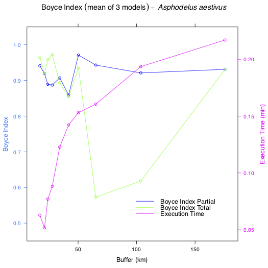

```{r setup, include=FALSE}
knitr::opts_chunk$set(echo = TRUE)
knitr::opts_chunk$set(eval = FALSE)
```

# Introduction

One of the crucial choices when using Species Distribution Models (SDM) based on pseudo-absences approaches is the delineation of the background area to fit the model. Defining its extent, however, remains a challenge and often studies are based on partial SDMs (i.e. models build with only part of the species geographic distribution)

*MinBAR* is an R package that aims at (1) defining the minimum or optimal background extent necessary to fit good partial SDMs and/or (2) determining whether the background area used to fit a partial SDM is reliable enough to extract ecologically relevant conclusions from it. In this vignette we show an example of *MinBAR* usage.

Please see the "preprinted" paper at https://www.biorxiv.org/content/10.1101/571182v1 for further details on the package *MinBAR* as well as for the references of other packages and works mentioned in this vignette.


# Preparing data

We need species occurrences, which can be downloaded from different public repositories. In this case we will use the Bioatles (http://bioatles.caib.es/), a data base of species on the Balearic Islands. The occurrences will be downloaded with the R package *PreSPickR* (https://github.com/xavi-rp/PreSPickR).

```{r}
library(devtools)
#install_github("xavi-rp/PreSPickR")
library(PreSPickR)

PreSPickR:::bioatles(sp_list = c("Asphodelus aestivus"), out_name = "sp_records_bioatles")

```


Then, we will download environmental data from WorldClim (https://worldclim.org/data/index.html) and will crop them to the extent of the archipelago.

```{r}
bioclim <- getData('worldclim', var='bio', res = 0.5, lon = 3, lat = 39,
                   path = paste0(getwd()))  # importing tile 16

bioclim <- raster::crop(bioclim, raster::extent(c(1, 4.4, 38.6, 40.2)))
```


# Running *MinBAR*

The idea behind *MinBAR* is to sequentially fit several concentric SDMs, each with an increased diameter, from the centre of the species geographical distribution to the periphery, until a model which satisfies user's needs is reached. We call "buffers" to these concentric SDMs. 

In order to evaluate the predictive performance of the models, *MinBAR* includes two metrics based on the Boyce Index, implemented in the R package *ecospat*. On the one hand, Boyce Index Partial (BI_part) evaluates the accuracy of predictions within the buffer (i.e. training area). On the other hand, Boyce Index Total (BI_tot) assesses predictions beyond the training area, across the whole distribution of the species (i.e. model transferability).

The user can choose either (1) to run the models for all the buffers to see if the selected background area is accurate and how the quality of the models evolves, or (2) to stop the process when it reaches certain conditions, which can be defined by the user as well. For this, the main function *minba()* has different arguments:

* BI_part: Maximum Boyce Index Partial to stop the process if reached
* BI_tot: Maximum Boyce Index Total to stop the process if reached
* SD_BI_part: Minimum SD of the Boyce Index Partial to stop the process if reached (last 3 buffers)
* SD_BI_tot: Minimum SD of the Boyce Index Total to stop the process if reached (last 3 buffers)

If all the four arguments are NULL, all buffers are preocessed. If one or the two BIs have a value, this or these are the maximum limit to be reached. If one or the two SD_BIs have a value, this or these are the minimum limit to be reached. In this example we will set all of them as NULL.

*minba()* is implemented for MaxEnt models and the user can choose to use either the R package *maxnet* (default) or the original java program, if installed. We will run it using *maxnet* with default parameters, except for the number of background points, which is set to 50% of pixels in the study area.

Now we can run *MinBAR* to fit the models. 

```{r}
#install_github("xavi-rp/MinBAR")
library(MinBAR)

MinBAR:::minba(occ = "sp_records_bioatles.csv",
               varbles = bioclim,
               wd = getwd(),
               prj = 4326,
               num_bands = 10, n_rep = 3,
               maxent_tool = "maxnet")
```

As results of the calculations, we can check both a csv file and a plot. While the former shows the best and second best buffer, both with and without execution time, the latter presents a plot with the evolution of the two Boyce Index with the increase of the buffer diameter in kilometres, as well as the execution time. 

```{r eval = TRUE}
rnk_best <- read.csv("rankingBestBuffer.csv", header = TRUE)
knitr::kable(rnk_best)
```
&nbsp;



